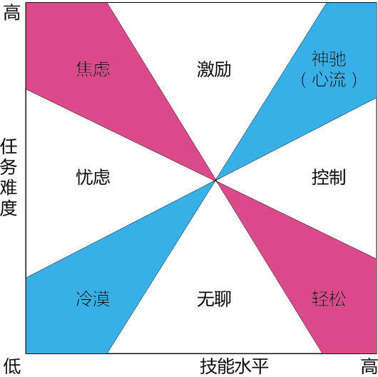

# 图鉴人生

##1 财务自由模型——你在物质生活上的终极追求

>####财务自由相信是很多人所追求的物质生活终极目标：每天清晨叫醒你的是对兴趣的追逐和对美好生活的享受，而不再是不工作就没有收入的压力。被动的收入可以在自己不付出主动劳动的时候仍旧源源不断涌入，没有了对物质的担忧，可以肆无忌惮地去追求精神的自由和自我价值的实现。上面这个矩阵很好地分析了财务自由的涵义和实现渠道。

矩阵中每个字母的涵义分别是：
* w：wealth，即财富，财富自由中财富的数量并没有绝对的定义，但以任何时候都可以保持你的高品质生活为宜。
* f：freedom，即自由，财富自由中的另一级，你不再囿于朝九晚五的规律性工作时间，而是实现时间的自由支配，向着星辰和大海昂首迈进。
* E：Employee，即被雇佣者，也就是我们说的普通职员，这是大部分人的状态，受雇于某个实体，有固定的上下班时间，某天不工作就意味着没有收入，无论是财富还是时间都是受到限制的。包括大部分职业经理人。
* S：Self-employed，即自由职业者，他们的时间是自由的，为自己打工，凭借自己的某个技能或掌握的有形资源进行专业化服务而获得报酬，但是同样一旦不付出主动性劳动就会丧失收入。当前很多“斜杠青年”就是这类人的代表，他们的辛苦也是有目共睹的，但好在，大部分人是干的自己喜欢的事情。
* B：Business owner，即企业所有人，这部分人经过了一定的原始积累，有了成体系的企业，企业的正常运转就可以带来稳定的收入流，但是，企业的所有人一旦放任企业不管，那么很可能就会出现企业的运转失灵，进而破产倒闭。因此，虽然在金钱上能够实现一定的自由支配，但是这部分人的时间仍旧不属于自己，必须在商场中时刻与竞争对手和经济形势进行打拼，以保证企业的持续运营。一些高级的职业经理人可以归入此类。
* I：Investor，即投资人，这部分人就是所谓的“用钱生钱”的人，他们本身拥有巨大的资源积累，仅仅投入资金或资源，掌握可实现持续收益项目的股权或最终所有权，不直接参与管理，仅负责收取投资的回报，即使整天在家里“葛优躺”，仍旧可以获得源源不断的现金流入，在金钱和时间上都实现了绝对的自由支配。所以，你可以看到，当前的股权投资如此盛行，“房爷房叔”坐在家里数着钞票乐此不疲。金融的力量是强大的，财富自由的人实现了钱追逐人而不是人去追逐钱。

所以，平常人要想实现财富自由是多么地艰难，但我们也可以看到一条理想中的路径：
>###被雇佣者或自由职业者获得第一桶金（或积累卓越技能） → 建立实体项目或企业或掌握企业绝对管理权实现持续运营和盈利 → 积累巨额财富 → 进行投资掌握资本或资源 → 收取红利或持续被动性收入

##2 神驰（心流）矩阵——专注做事的终极要义

##3 决策程序与PDCA循环——日常决策和执行的终极准则

>明确问题→制定标准→厘清利害→风险防范→决策实施→发现问题→明确问题

为什么要循环，这实际上就是一种经验的积累，就是成长所必须经历的一个过程，每一件事都按照PDCA循环的模式，有计划（Plan），有执行（Do），有检查（Check），有改进（Act），最终达到经验升华为标准化的流程和准则，为以后的此类事件提供模板和借鉴，这也是我们现在在做的事情。

##4 四象限模型与半衰期——时间管理的终极要义

文／笑夕暮（简书作者）
原文链接：http://www.jianshu.com/p/5e8388bda6c5
著作权归作者所有，转载请联系作者获得授权，并标注“简书作者”。